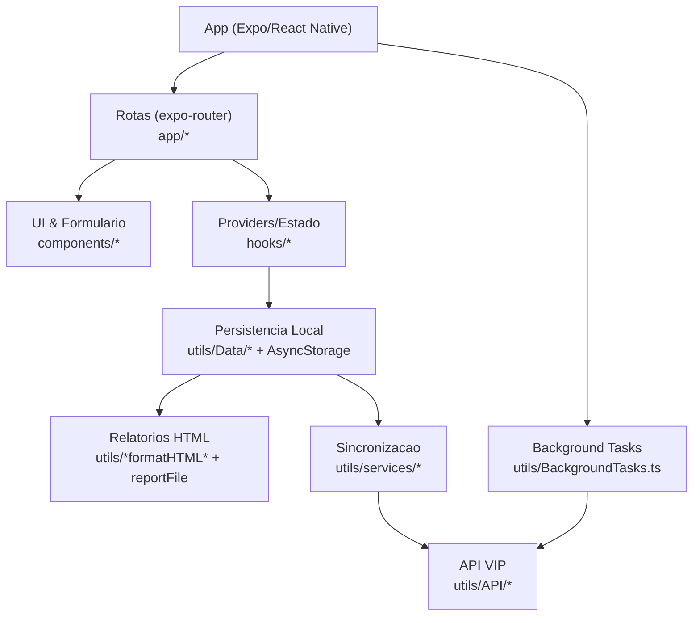

# VIP Mobile

Aplicativo mobile em Expo/React Native para rotinas de SST, com dois fluxos principais: **Levantamento** e **Visita Tecnica**.
O app opera offline, registra eventos com localizacao, gera relatorios HTML com assinatura e sincroniza com a API quando ha conexao.

## Para quem e este README

- Time de produto/operacoes: entender o que o app faz e como os fluxos se conectam.
- Time tecnico: mapear rapidamente rotas, estado, persistencia e sincronizacao.

## Principais capacidades

- Coleta estruturada de dados por empresa/setor/funcao (Levantamento).
- Checklists por setor e administrativos (Visita Tecnica).
- Relatorios HTML com assinatura e compartilhamento.
- Modo offline com sincronizacao posterior.
- Rastreio de localizacao em background e registro de eventos.

## Fluxos principais

### Levantamento

1. `app/(tabs)/Levantamento/index.tsx` cria a empresa e inicia o levantamento.
2. `setor.tsx` cadastra cada ambiente/setor.
3. `funcao.tsx` adiciona funcoes, funcionarios e riscos por setor.
4. `resumo.tsx` revisa os setores cadastrados.
5. `rascunho.tsx` mostra previa HTML e coleta assinatura.
6. `finalizado.tsx` gera o HTML final e compartilha o arquivo.

### Visita Tecnica

1. `app/(tabs)/Visita/index.tsx` escolhe empresa, tecnico e responsavel.
2. `Perguntas/Setor.tsx` aplica checklist por setor.
3. `Perguntas/Administrativo.tsx` aplica checklist administrativo.
4. `setores.tsx` revisa setores e define formato de salvamento.
5. `resumo.tsx` gera previa HTML e coleta assinatura.
6. `finalizado.tsx` salva localmente e tenta sincronizar com a API.

## Arquitetura em alto nivel



## Stack

- Expo SDK 54
- React 19.1 + React Native 0.81
- TypeScript
- Expo Router (rotas por arquivos)
- AsyncStorage
- Expo Location, Task Manager e Background Fetch
- Expo File System, Sharing, Print e WebView
- Biome (lint/format) e Jest

## Como rodar

### Requisitos

- Node.js LTS
- Yarn
- Android SDK / emulador ou dispositivo fisico
- Expo Go ou dev-client

### Comandos

```bash
yarn install

yarn start
# ou
# yarn android
# yarn ios
# yarn web

yarn lint
yarn test
```

Nota: o `app.json` lista apenas `android` em `platforms`. O iOS pode exigir ajustes antes de rodar localmente.

## Arquitetura (mapa rapido)

| Camada | Arquivos chave | O que faz |
| --- | --- | --- |
| Entrada | `package.json` (`expo-router/entry`) | Define o ponto de entrada do app. |
| Layout global | `app/_layout.tsx`, `components/Layout.tsx` | Monta o shell visual, inicializa dados, registra tarefas em background e aciona sincronizacao. |
| Navegacao | `hooks/Navigation.tsx` | Historico proprio de rotas com `push`, `replace` e `back`. |
| Estado de levantamento | `hooks/Levantamento/*` | Providers para empresa, setor e funcao com autosave. |
| Estado de visita | `hooks/VisitaTecnica/VisitaProvider.tsx` | Provider com perguntas, respostas e setores. |
| Persistencia | `utils/Storage.ts`, `utils/Data/*` | AsyncStorage, cache local e dados de dominio. |
| API e eventos | `utils/API/*` | Localizacao atual e envio de eventos para a API. |
| Sincronizacao | `utils/services/systemSync.ts`, `utils/services/visitaSync.ts` | Reenvio de eventos e visitas offline. |
| Relatorios | `utils/formatHTML.ts`, `utils/Visita/formatHTML.ts`, `utils/services/reportFile.ts` | Gera HTML e grava arquivos no sandbox do app. |

## Persistencia e sincronizacao

- `AsyncStorage` guarda empresas, perguntas, levantamentos, visitas e eventos.
- `utils/Storage.ts` define chaves e `base_url` (dev e prod).
- `utils/services/systemSync.ts` dispara sincronizacao no startup, reconexao e background fetch.
- `utils/services/visitaSync.ts` tenta enviar visitas pendentes e remove do cache local quando sucesso.
- `utils/API/Event.ts` envia eventos e faz fallback offline quando a rede falha.

## Localizacao em background

- `utils/BackgroundTasks.ts` define as tasks `RASTREIO_LOCATION_TASK` e `VIP_BACKGROUND_SYNC_TASK`.
- `components/Layout.tsx` registra as tasks, valida permissoes e reinicia o rastreio quando necessario.
- `utils/locationFilter.ts` suaviza pontos e aplica filtros de distancia/precisao.

## Relatorios e exportacao

- `utils/formatHTML.ts` gera HTML do levantamento.
- `utils/Visita/formatHTML.ts` gera HTML da visita tecnica.
- `utils/services/reportFile.ts` grava HTML no sandbox e compartilha.
- `utils/services/*Finalization.ts` consolida dados, salva localmente e dispara eventos.

## Estrutura do projeto

### Raiz

| Caminho | Funcao |
| --- | --- |
| `app/` | Rotas do Expo Router. |
| `assets/` | Imagens e fontes. |
| `components/` | Componentes de UI e formularios. |
| `hooks/` | Providers e navegacao. |
| `types/` | Tipos do dominio e modelagens SQL. |
| `utils/` | Servicos, dados, relatorios e tarefas. |
| `.expo/` | Metadados locais do Expo. |
| `app.json` | Configuracao do app e permissoes. |
| `eas.json` | Perfis de build do EAS. |
| `biome.json` | Lint e formatacao. |
| `babel.config.js` | Alias `@/` e configuracao do Babel. |
| `tsconfig.json` | Configuracao TypeScript. |

### app/

| Caminho | Funcao |
| --- | --- |
| `app/_layout.tsx` | Layout raiz e inicializacao de dados. |
| `app/index.tsx` | Home com atalhos para Levantamento, Visita e Config. |
| `app/(tabs)/Levantamento/*` | Fluxo de levantamento. |
| `app/(tabs)/Visita/*` | Fluxo de visita tecnica. |
| `app/(tabs)/Config/*` | Backup local, configuracoes e ferramentas de suporte. |
| `app/+not-found.tsx` | Tela de rota inexistente. |

### components/

| Caminho | Funcao |
| --- | --- |
| `components/Layout.tsx` | Shell visual, permissoes, sync e background tasks. |
| `components/Assinatura.tsx` | Captura de assinatura. |
| `components/Input.tsx` | Campo de texto padrao. |
| `components/VIPTabela.tsx` | Tabela de listagens. |
| `components/Visita/*` | Blocos do checklist de visita. |

### hooks/

| Caminho | Funcao |
| --- | --- |
| `hooks/Navigation.tsx` | Historico proprio de navegacao. |
| `hooks/Levantamento/*` | Estado do levantamento. |
| `hooks/VisitaTecnica/VisitaProvider.tsx` | Estado da visita tecnica. |

### utils/

| Caminho | Funcao |
| --- | --- |
| `utils/Storage.ts` | Chaves do AsyncStorage e `base_url`. |
| `utils/BackgroundTasks.ts` | Tasks de rastreio e sync em background. |
| `utils/locationFilter.ts` | Filtro e suavizacao de pontos de localizacao. |
| `utils/logger.ts` | Wrapper simples de logs. |
| `utils/formatHTML.ts` | HTML do levantamento. |
| `utils/Visita/formatHTML.ts` | HTML da visita. |
| `utils/services/*` | Finalizacao, exportacao e sincronizacao. |
| `utils/Data/*` | Managers de visitas, levantamentos e eventos. |
| `utils/API/*` | Envio de eventos e leitura de localizacao. |
| `utils/quests.ts` | Catalogo local de perguntas (fallback/manual). |

### types/

| Caminho | Funcao |
| --- | --- |
| `types/Levantamento/*` | Tipos do levantamento e modelagem SQL. |
| `types/VisitaTecnica/*` | Tipos da visita e modelagem SQL. |
| `types/VIPEvent.d.ts` | Tipos de eventos e localizacao. |

### assets/

| Caminho | Funcao |
| --- | --- |
| `assets/fonts/*` | Fontes do app. |
| `assets/images/*` | Icone e imagens. |

## Configuracao do app

- `app.json` define nome, pacote Android, permissoes e plugins.
- `utils/Storage.ts` alterna `base_url` conforme `__DEV__`.

## Notas

- O script `reset-project` aponta para `./scripts/reset-project.js`, mas o arquivo nao existe no repo atual.
- O arquivo `utils/Data/LevanamentoData.ts` usa a grafia `Levanamento` (sem "t").

## FAQ (Suporte ao usuario)

**O app funciona sem internet?**  
Sim. Ele guarda levantamentos, visitas e eventos localmente e sincroniza assim que a conexao voltar.

**Quando a sincronizacao acontece?**  
Automaticamente ao abrir o app, ao reconectar e em tarefas de background.

**Onde ficam os relatorios gerados?**  
Eles sao salvos no armazenamento interno do app e podem ser compartilhados pelo menu do proprio sistema.

**As perguntas da visita vem de onde?**  
O app tenta baixar da API. Se nao conseguir, usa o cache local e um catalogo de perguntas de fallback.

**Como o app lida com rastreio de localizacao?**  
Com permissoes ativas, ele registra pontos em background e envia eventos de forma controlada.

## Troubleshooting (suporte rapido)

**Relatorio nao aparece para compartilhar**  
Feche e reabra a tela de finalizacao. Se persistir, gere novamente pelo menu de configuracao/backup.

**Visita ficou como “offline”**  
Sem problema. Mantenha a internet ligada e abra o app para tentar sincronizar. Em geral resolve no proximo uso.

**Perguntas da visita nao carregam**  
Confirme conexao. Se estiver offline, o app usa o cache local automaticamente.

**Localizacao nao esta sendo registrada**  
Verifique se as permissoes de localizacao e “localizacao em background” estao ativas no sistema.

**App lento ou travando**  
Feche o app e abra novamente. Se o problema for frequente, avise o time tecnico com data/hora e modelo do aparelho.

